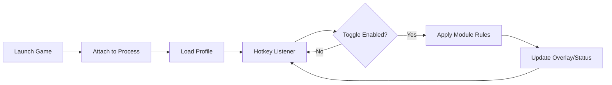

# The Blood of Dawnwalker Trainer

Avalon has its fog; Dawnwalker has its hunger. When a game asks for focus, timing, and endurance, repetition can start to feel like a slow drain. **The Blood of Dawnwalker Trainer** is a compact PC software companion built to streamline your sessions—giving you configurable toggles, rapid hotkeys, and quality-of-life controls that keep your momentum alive.

Think of it like a backstage crew: quiet, fast, and always ready when you call for it.

---

## Overview

This trainer is designed as a **modular gameplay control panel** for *The Blood of Dawnwalker* on Windows. It centers on “toggle-first” usability—features can be enabled and disabled instantly, with profiles that remember your preferences per build, difficulty, or playstyle.

Right away, you’ll notice the philosophy: keep it lightweight, keep it predictable, keep it yours.

**Highlights at a glance**

* Hotkey-driven activation (no menu diving mid-fight)
* Safe, reversible toggles (easy to disable, easy to reset)
* Profile presets (swap builds without rebuilding configs)
* Performance-aware behavior (avoid unnecessary overhead)

---

## ✨ Feature Modules

A good trainer doesn’t scream. It *responds*. Below are common modules you can enable depending on how you want your run to feel.

### Combat & Survival Controls 🛡️

* **Health / Stamina Management** (toggle-based helpers for longer encounters)
* **Cooldown Comfort** (reduce frantic key timing with cleaner rhythm)
* **Damage Tuning Presets** (adjust intensity for testing builds and routes)

### Progression & Farming Tools 🌾

* **Resource Convenience** (faster loop testing and crafting cycles)
* **Drop/Item Assistance** (quality-of-life scanning and filters for repeated routes)
* **XP/Level Pace Options** (useful for experimentation and quick iteration)

### Movement & Exploration 🧭

* **Speed Control** (walk/run multipliers for traversal-heavy areas)
* **No-Clip/Test Mode** *(optional, for controlled testing only)*
* **Jump/Gravity Tweaks** (for accessibility and experimentation)

### Interface & Control Layer 🎛️

* **Hotkey Manager** (rebind everything)
* **Overlay Readouts** *(optional)* for minimal status visibility
* **Profiles & Presets** (per character, per difficulty, per build)

> The goal isn’t to remove challenge—just to give you a dial instead of a wall.

---

## ⚡ Setup Guide

A clean install is a calm mind. Here’s the typical flow:

1. **Run the trainer as Administrator** (recommended for stable process access)
2. **Launch the game first**, then start the trainer
3. Select your **profile** (or create a new one)
4. Bind **hotkeys** for your must-have toggles
5. Use **Lite Mode** if you want minimal overlays and maximum performance
6. Save and export your config for backup

Example config snippet (illustrative):

```ini
[Hotkeys]
ToggleGodMode=F1
ToggleInfiniteStamina=F2
ToggleSpeed=F3
OpenOverlay=Insert

[Gameplay]
SpeedMultiplier=1.25
StaminaRegenBoost=1.35
```

### Recommended Starter Hotkeys

* **F1**: survival toggle (your “safety latch”)
* **F2**: stamina/energy comfort
* **F3**: movement speed
* **Insert**: overlay on/off (keep the screen clean when exploring)

---

## 🧠 How the Trainer Operates

The best tools are structured like good choreography: input → validation → action → feedback.



This loop keeps behavior **consistent**—you always know what’s active, what’s idle, and what’s been saved.

---

## Safety, Stability, and Good Habits

[!WARNING]
Use trainers responsibly. In any online, ranked, or shared environment, tools like this can violate terms and lead to penalties. If you’re unsure, keep usage strictly offline or in non-competitive contexts.

Practical tips:

* Prefer **toggle modules** over permanent edits
* Avoid stacking too many changes at once (harder to troubleshoot)
* If the game updates, re-check offsets/modules before enabling everything
* Keep a “vanilla profile” for quick return to default behavior

---

## FAQ

**Does the trainer include profiles for different playstyles?**
Yes—profiles are a core feature. You can keep one for exploration, one for combat testing, and one for “minimal assistance.”

**Will it slow down my game?**
In Lite Mode, overhead stays low. Overlays and frequent polling are the usual performance cost, so you can disable them anytime.

**Can I customize values like speed multipliers?**
That’s the point. Most modules include sliders or numeric entries, so you can tune subtle comfort (1.10×) or bold testing (1.50×).

**What happens after a game patch?**
Major patches can change how modules hook into the game. Keep an eye on update notes and start with your vanilla profile after patch day.

**Can I reset everything quickly?**
Yes—good trainers include a “panic key” or master disable option, plus config reset and profile deletion tools.

---

## Final Thoughts

Some nights you want a pure, sharp-edged challenge. Other nights you want flow—clean inputs, fewer chores, faster iteration, more time inside the story’s pulse. **The Blood of Dawnwalker Trainer** is built for that second kind of night: when you still want to play *hard*, but you don’t want to play *tired*.

A tool shouldn’t replace your choices. It should make them easier to express.

---
